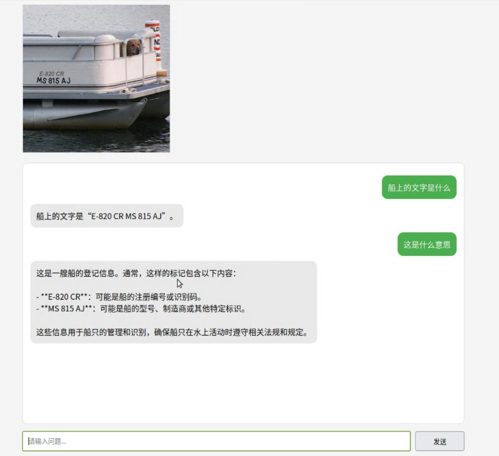
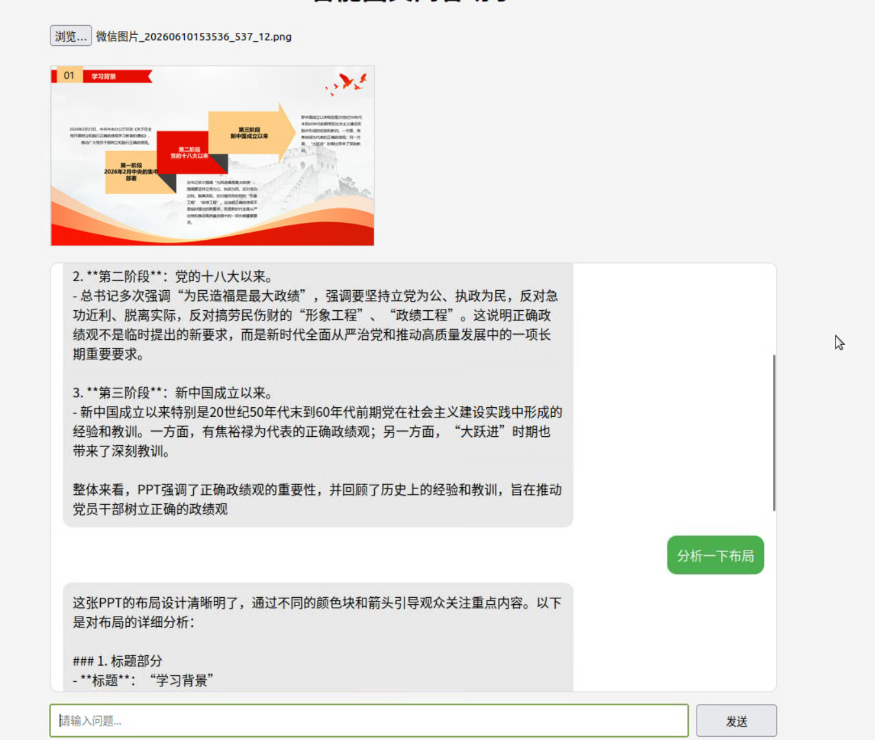
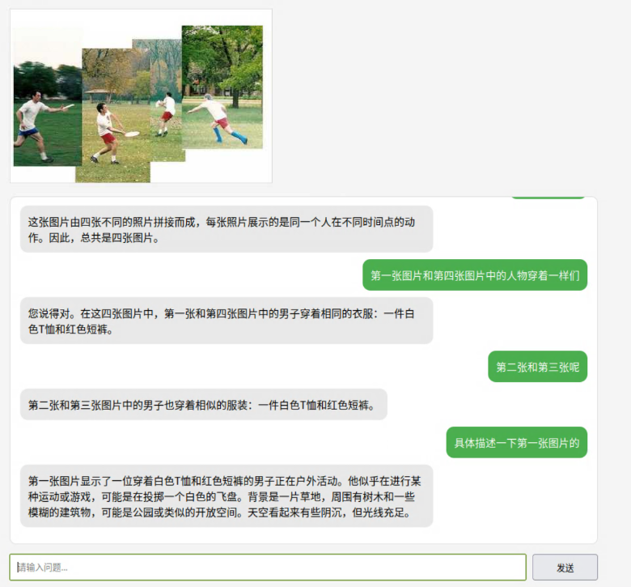
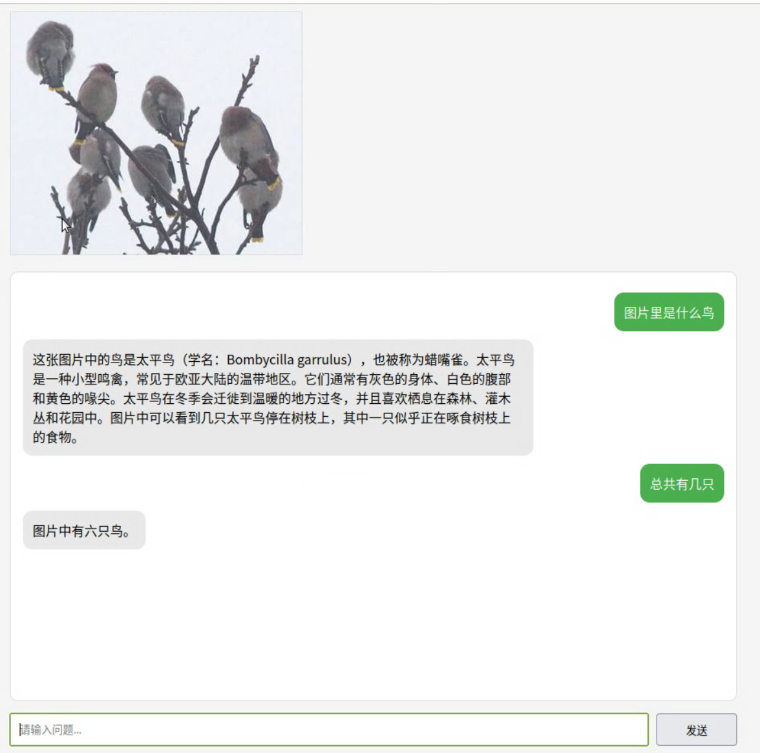
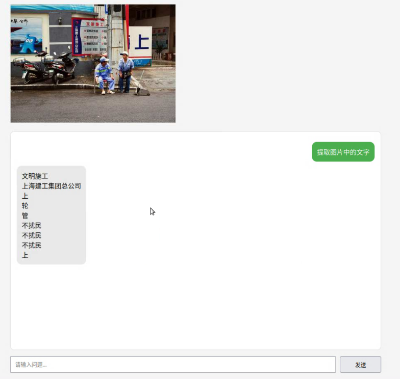

# 基于 Qwen2.5-VL 的智能图文问答助手设计与实现

# 第一章 绪论

## 1.1 研究背景

近年来，大语言模型（Large Language Model，LLM）在自然语言处理领域取得了突破性进展。然而传统语言模型仅能处理文本信息，无法直接理解图像内容。

随着 CLIP、LLaVA、Qwen-VL 等视觉语言模型的发展，人工智能系统逐渐具备跨模态理解能力，能够同时处理图像和文本输入，实现视觉问答（Visual Question Answering，VQA）、图像描述生成、多模态对话等任务。

视觉问答系统广泛应用于：

* 智能教育
* 智能客服
* 商品检索
* 文档分析
* 辅助办公

因此，构建一套具备图像理解与自然语言交互能力的智能图文问答系统具有较高的研究价值和应用价值。

## 1.2 项目目标

本项目旨在构建一套基于视觉语言模型的智能图文问答助手，实现以下功能：

（1）支持上传图片并进行自然语言问答；

（2）支持多轮连续对话；

（3）支持自然场景图像理解；

（4）支持文档截图与文本密集型图像问答；

（5）提供 Web 交互界面；

（6）在公开数据集上完成性能评测。

## 1.3 技术路线

本项目采用如下技术路线：

图片输入

↓

Flask 后端服务

↓

Qwen2.5-VL 模型推理

↓

生成回答

↓

Web 前端展示

同时构建 VQA-v2 与 TextVQA 评测流程，对系统性能进行量化分析。

# 第二章 相关技术介绍

## 2.1 视觉问答（VQA）

视觉问答任务要求模型根据图像内容回答用户提出的问题。

典型输入形式如下：

图片：
一张公交车图片

问题：
What color is the bus?

答案：
Yellow

视觉问答同时涉及：

* 图像理解
* 目标检测
* OCR识别
* 语言生成

属于典型的多模态人工智能任务。

## 2.2 Qwen2.5-VL 模型

Qwen2.5-VL 是阿里巴巴推出的新一代视觉语言模型。

主要特点：

* 支持图像与文本联合输入
* 支持多轮视觉对话
* 支持 OCR 理解
* 支持复杂视觉推理
* 支持中英文场景

本项目采用 Qwen2.5-VL-7B-Instruct 作为核心推理模型。

## 2.3 Flask 框架

Flask 是轻量级 Python Web 框架。

在本系统中负责：

* 接收用户上传图片
* 管理会话状态
* 调用模型推理
* 返回回答结果

## 2.4 Transformers

Transformers 提供：

* 模型加载
* Tokenizer
* Processor
* 推理接口

实现 Qwen2.5-VL 的快速部署。

# 第三章 系统设计

## 3.1 系统总体架构

系统采用前后端分离架构。

整体结构如下：

用户

↓

Web界面

↓

Flask服务

↓

会话管理模块

↓

Qwen2.5-VL推理模块

↓

返回答案

系统主要包括：

### 图像输入模块

负责接收用户上传图片。

### 会话管理模块

维护用户历史问题与模型回答。

### 模型推理模块

调用 Qwen2.5-VL 完成视觉理解和语言生成。

### 前端展示模块

负责显示用户提问和模型回答。

## 3.2 多轮对话设计

本系统支持基于同一张图片的连续多轮对话。

系统在后端维护全局变量：

```
chat_history = []
```

用于记录用户与模型的历史交互内容。

每次用户提问后，系统会将用户问题加入历史记录：

```
chat_history.append(
    {
        "role": "user",
        "content": question
    }
)
```

模型生成回答后：

```
chat_history.append(
    {
        "role": "assistant",
        "content": answer
    }
)
```

在模型推理阶段，系统遍历全部历史记录并重新构造消息列表（messages），从而实现上下文连续理解。

例如：

第一轮：

用户：这是什么饮料？

模型：Tokyo Black Porter

第二轮：

用户：它属于什么类型？

模型：Porter 风格黑啤酒

第三轮：

用户：这种啤酒口感如何？

模型：具有较浓的麦芽香气和烘焙风味。

## 3.3图片管理机制

系统采用单图片会话管理策略。

后端维护变量：

```python
current_image_name = None
```

用于记录当前会话对应的图片。

当检测到用户上传新的图片时：

```python
if image.filename != current_image_name:
    current_image_name = image.filename
    chat_history = []
```

系统自动清空历史对话记录。

该设计能够避免不同图片之间的上下文相互干扰。

例如：

图片A：

用户：这是什么饮料？

图片B：

用户：图片里有几个人？

如果不清除历史记录，模型可能错误地将饮料相关信息带入人物识别任务，从而影响回答质量。

因此当前版本采用“一张图片对应一个独立会话”的设计方案。

## 3.4 系统流程

步骤1：

用户上传图片。

步骤2：

图片保存至 uploads 文件夹。

步骤3：

构建消息格式。

步骤4：

调用 Qwen2.5-VL 推理。

步骤5：

生成回答。

步骤6：

结果返回前端展示。

# 第四章 系统实现

## 4.1 模型加载

系统启动时加载：

* Qwen2.5-VL-7B-Instruct
* AutoProcessor

采用：

device_map="auto"

实现自动设备映射。

## 4.2 Prompt构建与多模态输入实现

Qwen2.5-VL采用统一消息格式组织图像与文本输入。

系统首先构造如下结构：

```python
{
    "role":"user",
    "content":[
        {
            "type":"image",
            "image":image_path
        },
        {
            "type":"text",
            "text":question
        }
    ]
}
```

其中：

* image字段表示用户上传图片；
* text字段表示用户提出的问题。

随后调用：

```python
processor.apply_chat_template()
```

自动生成符合Qwen2.5-VL格式要求的Prompt。

接着通过：

```python
process_vision_info(messages)
```

提取图像输入。

最后调用：

```python
model.generate()
```

完成视觉理解与答案生成。

该设计能够同时支持：

* 图像理解
* 文本理解
* 多轮视觉对话

体现了视觉信息与语言信息的深度融合。

## 4.3 图文问答实现

系统使用消息格式组织输入：

用户消息：

* 图像
* 文本问题

模型消息：

* 历史回答

随后利用：

processor.apply_chat_template()

构造输入 Prompt。

最终调用：

model.generate()

完成回答生成。

## 4.3 Web交互实现

前端采用 HTML + JavaScript 实现。

主要功能：

* 图片上传
* 图片预览
* 聊天气泡显示
* 异步问答请求

后端采用 Flask 实现 REST 接口。

## 4.4 评测脚本实现

实现：

evaluate_vqa.py

用于评测 VQA-v2 数据集。

evaluate_textvqa.py

用于评测 TextVQA 数据集。

评测结果自动保存至 CSV 文件。

## 4.5 推理优化与显存管理

由于Qwen2.5-VL-7B模型参数规模较大，为保证系统能够在单张RTX3090显卡上稳定运行，项目采用了多项显存优化策略。

### （1）自动设备映射

模型加载时使用：

```python
device_map="auto"
```

自动将模型权重加载到可用GPU设备。

### （2）推理模式运行

在VQA评测过程中：

```python
with torch.inference_mode():
```

关闭梯度计算。

相比训练模式能够显著减少显存占用。

### （3）缓存释放

推理完成后：

```python
del inputs
del generated_ids
```

主动删除中间变量。

随后执行：

```python
gc.collect()
torch.cuda.empty_cache()
```

释放显存缓存。

该策略能够有效降低长时间评测过程中显存持续增长的问题。

# 第五章 实验设计与结果分析

## 5.1 实验环境

硬件环境：

* GPU：RTX 3090（24GB）

软件环境：

* Ubuntu 20.04
* Python 3.10
* PyTorch
* Transformers
* Flask

## 5.2 数据集与实验设置

为了验证系统性能，分别在自然场景图像数据集VQA-v2和文本密集型图像数据集TextVQA上进行测试。

### VQA-v2

从验证集随机抽取500个样本。

每个样本包含：

* 一张自然场景图片
* 一个问题
* 十个标注答案

系统调用ask_vqa接口完成推理。

### TextVQA

从验证集随机抽取200个样本。

每个样本包含：

* 一张包含文本信息的图片
* 一个问题
* 标准答案

系统调用ask_textvqa接口完成推理。

评测结果分别保存至：

* vqa_results.csv
* textvqa_results.csv

便于后续统计与错误分析。

采用准确率（Accuracy）作为评价指标。

VQA-v2：

采用官方 VQA Accuracy。

TextVQA：

采用答案匹配准确率。

## 5.3 实验结果

| 数据集  | 样本数 | 准确率 |
| ------- | ------ | ------ |
| VQA-v2  | 500    | 85%    |
| TextVQA | 200    | 70.1%  |

## 5.4 结果分析

实验结果表明：

（1）模型在自然场景图像上的表现优于文档图像；

（2）颜色识别和目标识别准确率较高；

（3）复杂文字识别能力有限；

（4）复杂推理任务仍存在错误。

# 第六章 案例分析

## 6.1 成功案例

案例1：



分析：

模型能够准确识别图片中的文字并且进行推理回复。

案例2：



分析：

模型能够识别ppt信息并根据信息回答。

## 6.2 失败案例

案例1：



回答错误。

原因：

多区域视觉定位错误和错误传播

案例2：



原因：

模型将视觉输入错误地映射到了语义数字上

案例3：



原因：

模型在处理复杂文字时的能力较弱。

# 第七章 存在问题与改进方向

## 7.1 存在问题

当前系统存在以下不足：

（1）推理速度较慢；

（2）复杂OCR场景表现有限；

（3）长对话上下文管理能力不足；

（4）复杂图表推理能力有待提升。

## 7.2 改进方向

### 多页PPT问答


当前系统仅支持单张图片问答。

对于课程讲义、PPT等长文档场景，用户的问题可能同时涉及多个页面内容。

未来计划引入“最近图片缓存+历史页面摘要”的多模态记忆机制。

具体流程如下：

上传PPT页面

↓

保存最近N页原始图片

↓

旧页面生成摘要

↓

用户提问

↓

相关页面检索

↓

Qwen2.5-VL推理

该方案能够在有限显存条件下支持跨页问答和长文档分析，进一步提升系统实用性。

同时，该模块也是本项目下一阶段的重要扩展方向

# 第八章 总结

本文基于 Qwen2.5-VL 构建了一套智能图文问答助手系统，实现了图像上传、多轮对话和视觉问答等功能，并设计了完整的 Web 交互界面。

实验结果表明，系统能够较好地完成自然场景图像和文档图像的问答任务，在物体识别、颜色判断和简单文本识别方面具有较高准确率。

未来将进一步引入 多页文档记忆机制，提高系统在复杂文档分析和跨页推理场景中的应用能力。
