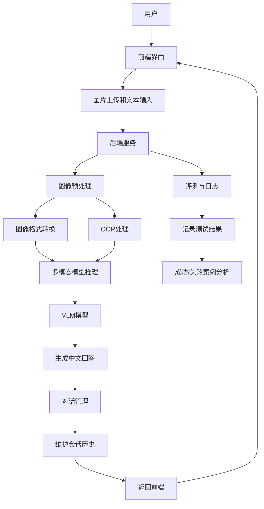

# 开题报告：基于VLM的智能图文问答助手

## 一、任务定义与应用背景

### 1.1 任务定义

构建一个基于视觉语言模型（Vision-Language Model, VLM）的智能图文问答助手，支持用户上传图片与文本问题，能够对自然场景图像和文档/幻灯片图像两类场景进行中文问答与基础推理。系统应实现多轮对话交互，用户可继续追问、澄清或补充上下文。

### 1.2 应用背景

随着移动互联网和智能视觉技术的发展，图文信息在电商、教育、办公、知识管理等场景中的需求急剧增加。用户希望通过上传商品图片、讲义截图、幻灯片内容等进行自然语言问答，帮助商品检索、信息提取、学习辅导和内容理解。

本项目旨在实现“看图/看文档能聊天”的多模态助手，提升图文问答的交互体验，特别是在中文图像理解与文本问答方面，实现更高的实用价值。

### 1.3 项目目标

- 支持图片上传+文本问题输入，返回对话式回答
- 支持自然场景图像和文档/幻灯片图像两类图像类型
- 支持中文问答与基础推理，如事实检索、区域定位、图像内容理解等
- 提供Web UI或命令行交互界面
- 在至少一个公开数据集子集上完成评测，并给出准确率或人工评分
- 输出典型成功与失败案例分析

## 二、相关工作调研

### 2.1 视觉语言模型发展

视觉语言模型（Vision-Language Model, VLM）旨在实现图像与文本的联合建模，是多模态人工智能的重要研究方向。其发展大致经历了从**跨模态表示学习 → 生成式多模态模型 → 指令微调多模态大模型**三个阶段。

#### 2.1.1跨模态表示学习阶段

早期工作以对齐图像与文本语义空间为目标，典型代表包括：

* CLIP（Contrastive Language-Image Pretraining）：通过大规模图文对进行对比学习，将图像与文本映射到统一语义空间，在零样本分类与图文检索任务中表现突出。
* BLIP（Bootstrapping Language-Image Pre-training）：在CLIP基础上进一步引入生成式预训练任务，使模型具备图像描述与基础问答能力。
* BLIP-2：通过引入轻量级查询模块（Q-Former）连接视觉编码器与大语言模型，在减少训练成本的同时显著提升多模态生成能力。

#### 2.1.2生成式多模态模型阶段

随着大语言模型的发展，研究者开始将视觉信息引入生成式框架，实现“看图说话”与多轮问答：

* LLaVA（Large Language and Vision Assistant）：通过将视觉编码器（如CLIP）输出的特征映射到大语言模型输入空间，实现视觉指令跟随（Visual Instruction Following），显著提升多模态对话能力。
* MiniGPT-4：利用少量高质量对齐数据，将视觉特征接入大语言模型，展现出较强的图像理解与生成能力。

#### 2.1.3统一多模态大模型阶段

近年来，多模态模型逐步向统一架构发展，强调端到端训练与多任务能力：

* Qwen-VL / Qwen2.5-VL：由阿里巴巴提出，具备较强的中文理解能力与文档图像处理能力，支持图像问答、OCR理解及复杂指令推理。
* LLaMA 3.2 Vision：在大语言模型基础上融合视觉模块，增强跨模态推理能力与多轮交互能力。
* Gemma 3-Vision、GLM-4V：进一步优化多模态推理效率，在资源受限环境下提升模型可部署性。

### 2.2 典型模型与技术路线

- Qwen2.5-VL（7B）：中文表现良好，适合文档类图像与自然场景问答。可直接推理，也支持按需LoRA微调。
- LLaMA 3.2 Vision：强大的视觉对话基础，适合多轮交互与复杂推理。
- Gemma 3-Vision：现代大模型，兼顾视觉理解与语言生成，可用于后端推理。
- GLM-4.6V-Flash：多模态混合架构，适合中文场景与文档理解。

### 2.3 评测数据集

- VQA-v2：经典视觉问答数据集，可用于自然场景问答基线评估。
- TextVQA：聚焦图像中嵌入文本问答，适合文档、幻灯片、票据等场景。
- 自建中文图文问答集：针对商品图、讲义截图、幻灯片等场景构建中文问答对，以补充公开数据集的语言与应用覆盖。

## 三、系统方案设计

### 3.1 系统总体架构

系统采用前端交互 + 后端多模态推理的架构，主要模块包括：

- 前端界面：实现图片上传、文本输入、多轮对话展示。可选Web UI（Flask/Django + HTML/JS）或命令行界面。
- 图像预处理：图片缩放、裁剪、OCR（针对文档/幻灯片场景）与图像格式转换。
- 多模态模型推理：采用VLM模型处理图像与文本输入，生成中文回答。
- 对话管理：维护历史上下文、问题追问与多轮会话状态。
- 评测与日志：记录测试结果、答复置信度、成功/失败案例。

### 3.2 模型选择

- 视觉编码器：使用开源视觉特征提取方法，如CLIP 图像编码器、BLIP 图像-文本编码器，或直接使用VLM内置视觉前端。
- 语言模型：选择Qwen2.5-VL作为推理核心。相较于 **LLaMA 3.2 Vision** 等模型，Qwen2.5-VL在中文场景下具有更高适配性；相较于模块化方法（CLIP+LLM），其端到端结构在复杂语义理解任务中表现更稳定。
- 推理方式：优先采用云端推理API或本地单卡4GB GPU推理；必要时使用LoRA对特定中文问答场景进行轻量微调。

### 3.3 系统流程

1. 用户上传图片并输入问题。
2. 前端将图像与文本传送至后端。
3. 后端对图片进行预处理（必要时OCR提取文本）。
4. 多模态模型接收视觉特征与文本问题，生成回答。
5. 回答返回前端，并保存会话历史，以支持多轮对话。

系统整体流程可抽象为：用户输入图像与问题，经前端传输至后端，后端进行图像预处理与特征提取后输入视觉语言模型进行联合推理，最终生成自然语言回答并返回前端，同时更新对话历史。

### 3.4 评测指标

- 准确率（Accuracy）：对公开数据集子集的问答结果与标准答案匹配程度。
- 人工评分：在自建中文样本上进行内容完整性、回答准确性和推理合理性打分。
- 响应效果分析：典型成功案例、失败案例与误答原因分析。

## 四、初步数据集与实验设计

### 4.1 数据集准备

- 公共数据集子集
  - 从VQA-v2中抽取典型中文转写问题或英文问答作为自然场景测试集。
  - 从TextVQA中选择含文本内容的图像，适配文档/幻灯片类问答。
- 自建中文图文问答集
  - 商品图场景：商品名称、价格、用途、配件、材质等问答。
  - 讲义/幻灯片场景：截图中的关键词提取、概念解释、公式理解、文档结构分析等问答。
  - 生成5-10组典型成功/失败案例，记录模型回答与真实标签。

### 4.2 评测方案

- 在公开数据集子集上进行推理测试，统计准确率并与基线比较。
- 对自建样本进行人工评分，记录回答正确性、语义完整性与推理合理性。
- 选择至少5个成功案例与5个失败案例，分析失败原因（OCR错误、视觉理解偏差、知识推理不足、上下文丢失等）。

### 4.3 算力预算

- 本地环境：NVIDIA GeForce RTX 3050 Laptop GPU，4GB 专用显存；系统内存 16GB；CPU 为 6 核 12 线程。
- 适用范围：本地设备适合做轻量级模型验证、图像预处理、OCR 调用、对话框架搭建与云端推理接口测试。
- 本地推理限制：4GB 专用显存对标准的 Qwen2.5-VL7B 级 VLM 模型不够，可调用云端 API 完成主要推理任务。
- 存储与数据处理：图像数据与问答对规模较小，主要瓶颈在显存和模型推理；本地存储可采用 SSD，内存 16GB 足以支撑数据加载与中等批量处理。

### 4.4 时间计划

- 第1周：需求分析与相关工作调研，完成项目方案设计。
- 第2周：环境搭建，完成基础推理框架搭建。
- 第3周：数据集准备与模型测试，完成数据采集与预处理脚本。
- 第4周：UI/交互界面实现与多轮对话管理。
- 第5周：评测与案例分析，完成准确率测试与人工评价。
- 第6周：撰写项目报告与演示材料，整理成功/失败案例。
